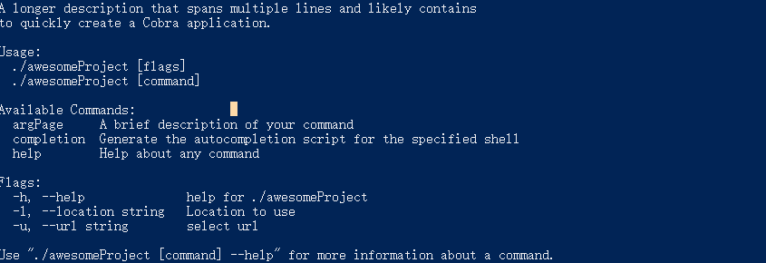
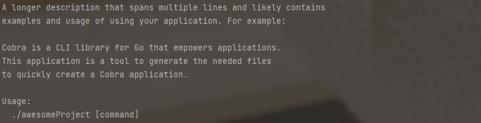
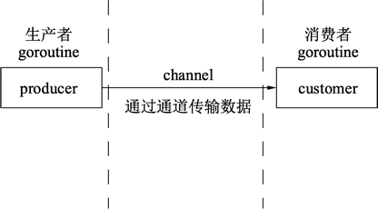

# Go常用示例代码片段

如果觉得GitHub没有目录可以访问我的博客
https://fz1lin.com/2023/3397475585/

## 介绍

只是列举了，常用的代码片段，封装成函数，直接调用，如果想修改其他功能直接替换调核心代码即可，方便下次直接使用。

ps：写Java写习惯了，喜欢用一个类表示一个功能

代码放在了GitHub上面：https://github.com/fz1lin/goFragment

## 参考链接

[https://blog.gm7.org/个人知识库/03.编程开发/GO/02.GO常用实例.html](https://blog.gm7.org/个人知识库/03.编程开发/GO/02.GO常用实例.html "https://blog.gm7.org/个人知识库/03.编程开发/GO/02.GO常用实例.html")

[https://go-zh.org/pkg/](https://go-zh.org/pkg/ "https://go-zh.org/pkg/")

[https://learnku.com/docs/build-web-application-with-golang/about-this-book/3151](https://learnku.com/docs/build-web-application-with-golang/about-this-book/3151 "https://learnku.com/docs/build-web-application-with-golang/about-this-book/3151")

[http://c.biancheng.net/view/2.html](http://c.biancheng.net/view/2.html "http://c.biancheng.net/view/2.html")

## I/O读写文件

代码路径 /readWrite

各种格式的速度以及大小对比

| 后缀    | 读取 | 写入 | 大小(KiB) | 读/写LOC       | 格式            |
| ------- | ---- | ---- | --------- | -------------- | --------------- |
| .gob    | 0.3  | 0.2  | 7948      | 21 + 11 =32    | Go二进制        |
| .gob.gz | 0.5  | 1.5  | 2589      | 21 + 11 =32    | Go二进制        |
| .jsn    | 4.5  | 2.2  | 16283     | 32+17 = 49     | JSON            |
| .jsn.gz | 4.5  | 3.4  | 2678      | 21 + 11 =32    | JSON            |
| .xml    | 6.7  | 1.2  | 18917     | 45 + 30 = 75   | XML             |
| .xml.gz | 6.9  | 2.7  | 2730      | 45 + 30 = 75   | XML             |
| .txt    | 1.9  | 1.0  | 12375     | 86 + 53 = 139  | 纯文本（UTF-8） |
| .txt.gz | 2.2  | 2.2  | 2514      | 86 + 53 = 139  | 纯文本（UTF-8） |
| .inv    | 1.7  | 3.5  | 7250      | 128 + 87 = 215 | 自定义二进制    |
| .inv.gz | 1.6  | 2.6  | 2400      | 128 + 87 = 215 | 自定义二进制    |

### 读取文件

按照字节读取内容，返回读取的内容

```go
//filename 输入文件读取文件的名字
//返回读取内容
func ReadFileFunc(fileName string) string {
  //打开文件
  file, err := os.Open(fileName)
   if err != nil {
    return "文件打开失败，没有" + fileName + "文件"
  }
  //及时关闭 file 句柄，否则会有内存泄漏
  defer file.Close()
 
  //读取内容
  buf := make([]byte, 1024)
  var res string
  for {
    count, err := file.Read(buf)
    if err == io.EOF {
      break
    } else {
      currBytes := buf[:count]
      res += string(currBytes)
    }
  }
  
  return res
}
```

### 写入文件

写入到一个新的文件中

```go
// writeString 写入的字符串
// newfileName 创建新的文件名字
func WriteFileFunc(writeString string, newfileName string) bool {
  //创建文件
  file, err := os.Create(newfileName)
  if err != nil {
    fmt.Println(err)
  }
  defer file.Close()

  // 写入文件内容
  _, err = io.WriteString(file, writeString)
  if err != nil {
    fmt.Println(err)
  }
  return true
}

```

## 正则表达式

常用正则

[https://github.com/cdoco/learn-regex-zh](https://github.com/cdoco/learn-regex-zh "https://github.com/cdoco/learn-regex-zh")

[https://github.com/jaywcjlove/regexp-example](https://github.com/jaywcjlove/regexp-example "https://github.com/jaywcjlove/regexp-example")

也可以借助chatGPT，你发送一个字符片段，你给他说，我要使用go语言，正则提取xxx内容，就会返回一个正则表达式。

### 提取

go内置语法参考

[https://go-zh.org/pkg/regexp/](https://go-zh.org/pkg/regexp/ "https://go-zh.org/pkg/regexp/")

提取，根据正则表达式，提取对应的内容

```go
// regexString 正则表达式
// value 匹配的内容
// 返回匹配内容的值
func RegexFunc(regexString string, value string) string {
  var res string
  regex, _ := regexp.Compile(regexString)
  // 在字符串中查找匹配项
  matches := regex.FindAllString(value, -1)
  // 输出匹配项
  for _, res = range matches {
  }
  return res
}
```

## JSON 相关处理

### JSON转换为map

```go
//jsonStr := `{"name": "Alice", "age": 20}`
func JsonSwitchMap(jsonStr string) map[string]interface{} {
  // 将 JSON 数据转换为 map
  var data map[string]interface{}
  err := json.Unmarshal([]byte(jsonStr), &data)
  if err != nil {
    fmt.Println(err)
  }
  return data
}

//map[age:20 name:Alice]

```

### JSON转换为切片

```go
//jsonStr := `[{"name": "Bob", "age": 25}, {"name": "Charlie", "age": 30}]`
func JsonSwitchSlice(jsonStr string) []map[string]interface{} {
  var data []map[string]interface{}
  err := json.Unmarshal([]byte(jsonStr), &data)
  if err != nil {
    fmt.Println(err)
  }
  return data
}
//[map[age:25 name:Bob] map[age:30 name:Charlie]]

```

### map转换为JSON

传入json数据

```go
  mapData := map[string]interface{}{
    "name":  "John",
    "age":   30,
    "email": "example.com",
  }
```

转换

```go
func MapSwitchJson(mapData map[string]interface{}) string {
  // 将 map 转换为 JSON 字符串
  jsonBytes, err := json.Marshal(mapData )
  if err != nil {
    fmt.Println(err)
  }
  // 将 JSON 字符串转换为字符串类型输出
  jsonString := string(jsonBytes)
  return jsonString
}

//{"age":30,"email":"example.com","name":"John"}

```

### JSON序列化

序列化指将 Go 语言数据结构转换为 JSON 格式的字符串。可以使用 `json.Marshal()` 函数来实现序列化操作

```go
// 定义结构体，变量名注意大写，因为跨到json包了
type Address struct {
  Street string `json:"street"`
  City   string `json:"city"`
  State  string `json:"state"`
}

type Person struct {
  Name    string  `json:"name"`
  Age     int     `json:"age"`
  Address Address `json:"address"`
}

func main() {
  person := Person{
    Name: "Alice",
    Age:  25,
    Address: Address{
      Street: "123 Main St",
      City:   "Anytown",
      State:  "CA",
    },
  }
  //序列化结构体
  jsonString, err := json.Marshal(person)
  if err != nil {
    log.Fatal(err)
  }
  fmt.Println(string(jsonString))
}

```

使用 `json.Marshal()` 函数序列化时，结构体成员名称的首字母必须大写，否则该成员将不会被序列化。为了指定 JSON 字段的名称，可以使用结构体标记（tag）来标注成员

### JSON反序列化

反序列化指将 JSON 格式的字符串转换为对应的 Go 语言数据结构。可以使用 `json.Unmarshal()` 函数来实现反序列化操作

```go
type Addresss struct {
  Street string `json:"street"`
  City   string `json:"city"`
  State  string `json:"state"`
}

type Persons struct {
  Name    string  `json:"name"`
  Age     int     `json:"age"`
  Address Address `json:"address"`
}

func main() {
  jsonString := `{"name": "Alice", "age": 25, "address": {"street": "123 Main St", "city": "Anytown", "state": "CA"}}`
  var persons Persons
  err := json.Unmarshal([]byte(jsonString), &persons)
  if err != nil {
    log.Fatal(err)
  }
  fmt.Printf("%+v\n", persons)
}

```

### json包

导入json包

```go
go get github.com/json-iterator/go

```

## 时间日期

/times包下

```go
func main() {
  //获取当前时间
  now := time.Now()
  fmt.Println(now)

  //获取时间戳
  fmt.Println(now.Unix())
  //格式化时间
  fmt.Println(now.Format("2006-01-02 15:04:05.000 Mon Jan"))
  fmt.Println(now.Format("2006-01-02 15:04:05"))
  fmt.Println(now.Format("20060102"))
}
```

### 函数运行时间

```go
func TimeSince(f func()) string {
  start := time.Now() // 获取当前时间
  f()                 // 执行传入的函数
  // 获取结束的时间
  elapsed := time.Since(start)
  str := fmt.Sprintf("该函数执行完成耗时：%v", elapsed)
  return str
}

func main() {
  result := TimeSince(timeTest)
  fmt.Println(result)
}

func timeTest() {
  // 运行的函数
  sum := 0
  for i := 0; i < 1111111111; i++ {
    sum++
  }
}

//该函数执行完成耗时：318.3731ms

```

go并发读取txt

## 随机数

### 生成随机数

```go
//start 10，end 20，将获得这之间的随机数
func RandomSum(start int, end int) int {
  // 以当前时间戳作为种子，确保每次生成的随机数都不同
  rand.Seed(time.Now().Unix())
  // 生成一个指定范围之间的随机整数

  randomInt := rand.Intn(end-start+1) + start
  return randomInt
}
```

### 生成随机字符串

```go
const (
  letterBytes  = "abcdefghijklmnopqrstuvwxyz"
  capitalBytes = "ABCDEFGHIJKLMNOPQRSTUVWXYZ"
  numberBytes  = "0123456789"
  symbolBytes  = "!@#$%^&*()"
)

func RandStringBytes(n int, randomString string) string {
  rand.Seed(time.Now().Unix())
  b := make([]byte, n)
  for i := range b {
    b[i] = randomString[rand.Intn(len(randomString))]
  }
  return string(b)
}

func main() {
//传入随机字符串的长度，以及需要随机那些字符串
  randomString := RandStringBytes(10, letterBytes+numberBytes)
  fmt.Println(randomString)
}
```

## URL解析

```go
func main() {
  // 要解析的 URL 字符串
  urlString := "https://www.example.com/path/to/resource?key1=value1&key2=value2#fragment"

  // 解析 URL 字符串
  parsedUrl, err := url.Parse(urlString)
  if err != nil {
    panic(err)
  }

  // 输出解析后的 URL 的各个部分
  fmt.Println("Scheme:", parsedUrl.Scheme)
  fmt.Println("Host:", parsedUrl.Host)
  fmt.Println("Path:", parsedUrl.Path)
  fmt.Println("RawQuery:", parsedUrl.RawQuery)
  fmt.Println("Fragment:", parsedUrl.Fragment)

  // 解析 URL 的查询参数
  query := parsedUrl.Query()
  fmt.Println("key1:", query.Get("key1"))
  fmt.Println("key2:", query.Get("key2"))
}
```

## base64

```go
// base64编码
func base64Encode(encodeStr string) string {
  return base64.StdEncoding.EncodeToString([]byte(encodeStr))
}

//base64解码
func Base64Decode(decodeStr string) string {
  decoded, err := base64.StdEncoding.DecodeString(decodeStr)
  if err != nil {
    panic(err)
  }
  return string(decoded)
}
```

## 命令行参数

### 标准库（不推荐）

parseArgs为主要的函数

```go
package main

import (
  "fmt"
  "os"
)

func main() {
  argsMap := parseArgs()

  if argA, ok := argsMap["-a"]; ok {
    //获取-a 参数后面的值
    fmt.Println(argA)
  }
  if _, ok := argsMap["-b"]; ok {
    //如果有 -b 就执行该函数
    test()
  }
}

func ParseArgs() map[string]string {
  argsMap := make(map[string]string)
  for i := 1; i < len(os.Args); i++ {
    arg := os.Args[i]
    if i < len(os.Args)-1 {
      argsMap[arg] = os.Args[i+1]
    } else {
      argsMap[arg] = ""
    }
  }
  return argsMap
}

func test() {
  fmt.Println("test")
}


```

### Cobra 库（推荐）

[https://github.com/spf13/cobra](https://github.com/spf13/cobra "https://github.com/spf13/cobra")

以下代码示例



安装和导入

举例子

```go
hugo server --port=1313 //server 代表 command， port 代表 flag。
git clone URL --bare   //clone 代表 command，URL 代表操作的物-argument，bare 代表 flag。
```

```go
//安装
go get -u github.com/spf13/cobra@latest
go install github.com/spf13/cobra-cli@latest

//导入
import "github.com/spf13/cobra"

```

项目目录下运行初始化

会创建一个`cmd/root.go` 和`main.go`

```go
cobra-cli init  
```

root.go是这个地方的描述



增加command 命令

生成一个`cmd/argPage.go`

```go
cobra-cli add argPage
```


cmd/argPage.go

```go
package cmd

import (
  "fmt"
  "github.com/spf13/cobra"
  "os"
)

// argPageCmd represents the argPage command
var argPageCmd = &cobra.Command{
  Use:   "argPage",
  Short: "A brief description of your command",
  Long: `A longer description that spans multiple lines and likely contains examples
and usage of using your command. For example:

Cobra is a CLI library for Go that empowers applications.
This application is a tool to generate the needed files
to quickly create a Cobra application.`,
  PersistentPreRun: func(cmd *cobra.Command, args []string) {
    //检测是否输入args没有输入args就打印帮助
    if len(args) == 0 && len(os.Args) == 1 {
      // 如果没有提供命令或标志，则打印所有标志的帮助信息
      cmd.HelpFunc()(cmd, args)
      os.Exit(0)
    }
  },
  Run: runArgPage,
}

func init() {
  rootCmd.AddCommand(argPageCmd)
  //这里添加argPageCmd的标志位置
  argPageCmd.PersistentFlags().StringP("All", "a", "", "All to use")
}

func runArgPage(cmd *cobra.Command, args []string) {

  //处理All
  All, err := cmd.Flags().GetString("All")
  if err != nil {
    // Handle error
  }
  if All != "" {
    fmt.Println("All is:", All)
  }
}


```

main.go

```go
package main

import "awesomeProject/cmd"

func main() {
  cmd.Execute()
}
```

增加root flag标志位


```go
package cmd

import (
  "fmt"
  "os"

  "github.com/spf13/cobra"
)

var rootCmd = &cobra.Command{
  //usage标志位
  Use:   "./awesomeProject",
  //简短的描述
  Short: "A brief description of your application",
  //详细的描述
  Long: `A longer description that spans multiple lines and likely contains
to quickly create a Cobra application.`,
  PersistentPreRun: func(cmd *cobra.Command, args []string) {
    //检测是否输入args没有输入args就打印帮助
    if len(args) == 0 && len(os.Args) == 1 {
      // 如果没有提供命令或标志，则打印所有标志的帮助信息
      cmd.HelpFunc()(cmd, args)
      os.Exit(0)
    }
  },
  Run: run,
}

//root的入口，在main.go中调用cmd.Execute()
func Execute() {
  err := rootCmd.Execute()
  if err != nil {
    os.Exit(1)
  }
}

// 增加标志位
func init() {
  // 增加flags标志位-核心代码
  rootCmd.Flags().StringP("location", "l", "", "Location to use")
  rootCmd.Flags().StringP("url", "u", "", "select url")
}

// 处理标志位指定的值
func run(cmd *cobra.Command, args []string) {
  
  //处理location
  location, err := cmd.Flags().GetString("location")
  if err != nil {
    // Handle error
  }
  if location != "" {
    fmt.Println("Location is:", location)
  }

  //处理url
  url, err := cmd.Flags().GetString("url")
  if err != nil {
  }
  if url != "" {
    fmt.Println("url is"+url)
  }
}

```

完整代码路径

`/cmd/root.go，/cmd/argPage.go ,main.go`

## 执行系统命令

```go
func main() {
  //cmd := exec.Command("calc.exe")
  cmd := exec.Command("ls", "-la")
  output, err := cmd.Output()
  if err != nil {
    fmt.Println(err)
    return
  }
  fmt.Println(string(output))
}
```

## HTTP

nc监听go发送的包

```go
nc -l 47414
```

### 发送get请求

```go
func main() {
  m := GetFunc("https://baidu.com")
  fmt.Println(m["code"])
  
}

func GetFunc(url string) map[string]interface{} {
  valueMap := make(map[string]interface{})
  response, err := http.Get(url)
  if err != nil {
    fmt.Println("Error while getting the response:", err)
  }
  defer response.Body.Close()
  code := response.StatusCode
  header := response.Header.Get("Server")
  body, err := io.ReadAll(response.Body)
  if err != nil {
    fmt.Println(err)
  }
  valueMap["code"] = code
  valueMap["header"] = header
  valueMap["body"] = string(body)

  return valueMap

}

```

### 自定义Header (GET)

必须要传自定义的header

```go
package main

import (
  "fmt"
  jsoniter "github.com/json-iterator/go"
  "io"
  "net/http"
  "time"
)

func main() {
  //参数拼接即可
  url := "http://httpbin.org/get"
  //自定义 ua
  headerCustom := map[string]string{
    "User-Agent": "123",
    "name":       "771",
  }
  
  headerFunc := GetCustomHeaderFunc(url, headerCustom)
  //fmt.Println(headerFunc["body"])
  fmt.Println(headerFunc["headers"])
}

func GetCustomHeaderFunc(url string, headerMap interface{}) map[string]interface{} {
  req, err := http.NewRequest("GET", url, nil)
  respMap := make(map[string]interface{})
  if err != nil {
    fmt.Println(err)
  }

  m := headerMap.(map[string]string)
  var headerKey string
  var headerValue string

  for k, v := range m {
    headerKey = k
    headerValue = v
  }
  //设置header头
  req.Header.Set(headerKey, headerValue)
  client := http.Client{
    Timeout: 3 * time.Second, //超时时间
  }

  resp, err := client.Do(req)
  if err != nil {
    fmt.Println(err)
  }
  body, _ := io.ReadAll(resp.Body)
  headers := jsoniter.Get(body, "headers")

  respMap["body"] = string(body)
  respMap["headers"] = headers.ToString()
  return respMap

}


```

```go
{
    "Accept-Encoding": "gzip",
    "Host": "httpbin.org",
    "Name": "771",
    "User-Agent": "Go-http-client/1.1",
    "X-Amzn-Trace-Id": "Root=1-6437f80d-659f86f30de19c1d031f51cd"
  }

```

### 发送post请求(自定义)

简单的

```go
func SendPostRequest(url string, payload []byte, headers map[string]string) (*http.Response, error) {
  req, err := http.NewRequest("POST", url, bytes.NewBuffer(payload))
  if err != nil {
    return nil, err
  }

  // 设置请求头部
  for key, value := range headers {
    req.Header.Set(key, value)
  }

  // 发送请求
  client := &http.Client{}
  resp, err := client.Do(req)
  if err != nil {
    return nil, err
  }

  return resp, nil
}

// 调用
func main() {
  url := "https://example.com/api"
  payload := []byte(`{"key": "value"}`)
  headers := map[string]string{
    "Content-Type":  "application/json",
    "Authorization": "Bearer abc123",
  }

  resp, err := SendPostRequest(url, payload, headers)
  if err != nil {
    fmt.Println(err)
    return
  }
  body := resp.Body
  fmt.Println(body)
  // 处理响应
}


```

发送的结果

```go
POST /api HTTP/1.1
Host: example.com
Content-Type: application/json
Content-Length: 23
Authorization: Bearer abc123

{"key": "value"}
```

### 忽略证书

```go
func main() {
  // 创建一个 http.Transport，设置忽略 SSL 证书验证
  tr := &http.Transport{
    TLSClientConfig: &tls.Config{InsecureSkipVerify: true},
  }

  // 创建一个 http.Client，指定上面创建的 http.Transport
  client := &http.Client{Transport: tr}

  // 发送一个 GET 请求
  resp, err := client.Get("https://example.com")
  if err != nil {
    fmt.Println(err)
    return
  }
  defer resp.Body.Close()

  // 输出响应结果
  fmt.Println(resp.Status)
}

```

## 代理

### http代理

```go
// 设置本程序全局代理
func SetGlobalHttpProxy(proxyServer string) error {
  if proxyServer == "" {
    return nil
  }

  proxyURL, err := url.Parse(proxyServer)
  if err != nil {
    return fmt.Errorf("Error parsing proxy server address: %s", err)
  }

  http.DefaultTransport = &http.Transport{Proxy: http.ProxyURL(proxyURL)}
  return nil
}

func main() {
  //调用代理,可以判断结合命令行参数进行调用
  proxyServer := "http://127.0.0.1:123"
  if err := SetGlobalHttpProxy(proxyServer); err != nil {
    fmt.Println(err)
    return
  }
}

```

### socks代理

```go
package proxys

import (
  "fmt"
  "golang.org/x/net/proxy"
  "net/http"
  "net/url"
  "time"
)

func SetGlobalSocksProxy(proxyServer string) error {
  if proxyServer == "" {
    return nil
  }

  proxyURL, err := url.Parse(proxyServer)
  if err != nil {
    return fmt.Errorf("Error parsing proxy server address: %s", err)
  }

  dialer, err := proxy.FromURL(proxyURL, proxy.Direct)
  if err != nil {
    return fmt.Errorf("Error creating SOCKS5 dialer: %s", err)
  }

  http.DefaultTransport = &http.Transport{
    Dial:                dialer.Dial,
    DialContext:         dialer.(proxy.ContextDialer).DialContext,
    DialTLS:             dialer.Dial,
    DialTLSContext:      dialer.(proxy.ContextDialer).DialContext,
    TLSHandshakeTimeout: 10 * time.Second,
  }

  return nil
}

func main() {
  //调用代理,可以判断结合命令行参数进行调用
  if err := SetGlobalSocksProxy("127.0.0.1:123"); err != nil {
    fmt.Println(err)
    return
  }
}

```

## 并发



生产者每秒生成一个字符串，并通过通道传给消费者，生产者使用两个 goroutine 并发运行，消费者在 main() 函数的 goroutine 中进行处理。

仅仅通过关键字 go 实现 goroutine，和通道实现数据交换

```go
package main

import (
  "fmt"
  "math/rand"
  "time"
)

// 数据生产者
func producer(header string, channel chan<- string) {
  // 无限循环, 不停地生产数据
  for {
    // 将随机数和字符串格式化为字符串发送给通道
    channel <- fmt.Sprintf("%s: %v", header, rand.Int31())
    // 等待1秒
    time.Sleep(time.Second)
  }
}

// 数据消费者
func customer(channel <-chan string) {
  // 不停地获取数据
  for {
    // 从通道中取出数据, 此处会阻塞直到信道中返回数据
    message := <-channel
    // 打印数据
    fmt.Println(message)
  }
}
func main() {
  // 创建一个字符串类型的通道
  channel := make(chan string)
  // 创建producer()函数的并发goroutine
  go producer("cat", channel)
  go producer("dog", channel)
  // 数据消费函数
  customer(channel)
}

```

```go
cat: 402107940
dog: 512906503
cat: 1348830552
dog: 272199843
cat: 604152205
dog: 881161598
dog: 933967425
cat: 1342381351

```

### 并发发送http请求

```go
package main

import (
  "fmt"
  "io"
  "net/http"
  "sync"
  "time"
)

type Response struct {
  Url        string
  StatusCode int
  Body       string
  Error      error
}

func fetchURL(url string, wg *sync.WaitGroup, ch chan<- Response) {
  defer wg.Done()

  resp, err := http.Get(url)
  if err != nil {
    ch <- Response{Url: url, Error: err}
    return
  }
  defer resp.Body.Close()

  body, err := io.ReadAll(resp.Body)
  if err != nil {
    ch <- Response{Url: url, Error: err}
    return
  }

  ch <- Response{Url: url, StatusCode: resp.StatusCode, Body: string(body)}
}

func fetchAllURLs(urls []string, maxConcurrency int) []Response {
  ch := make(chan Response, len(urls))
  var wg sync.WaitGroup

  for _, url := range urls {
    wg.Add(1)
    go fetchURL(url, &wg, ch)
  }

  wg.Wait()
  close(ch)

  var results []Response
  for resp := range ch {
    results = append(results, resp)
  }

  return results
}

func main() {
  start := time.Now() // 获取当前时间
  urls := []string{
    "https://www.google.com",
    "https://www.facebook.com",
    "https://www.apple.com",
    "https://www.amazon.com",
  }

  //传入url列表，以及并发数量发送http请求
  responses := fetchAllURLs(urls, 1)

  //接口返回的值
  for _, resp := range responses {
    if resp.Error != nil {
      fmt.Printf("Error fetching %s: %s\n", resp.Url, resp.Error)
    } else {
      fmt.Printf("%s returned status %d, body length %d\n", resp.Url, resp.StatusCode, len(resp.Body))
    }
  }

  //获取结束的时间
  elapsed := time.Since(start)
  fmt.Println("该函数执行完成耗时：", elapsed)
}


```

## web 服务器

类似于，python3 -m http.server

```go
func main() {
  http.Handle("/", http.FileServer(http.Dir(".")))
  http.ListenAndServe(":8082", nil)
}
```

## windows 编译多个平台程序

### 设置`GOOS`和`GOARCH`环境变量来指定目标平台的操作系统和CPU架构

-   Windows 64位：`GOOS=windows`，`GOARCH=amd64`
-   Windows 32位：`GOOS=windows`，`GOARCH=386`
-   macOS 64位：`GOOS=darwin`，`GOARCH=amd64`
-   Linux 64位：`GOOS=linux`，`GOARCH=amd64`
-   Linux 32位：`GOOS=linux`，`GOARCH=386`
-   Linux ARMv5（如树莓派）：`GOOS=linux`，`GOARCH=arm`，`GOARM=5`
-   Linux ARMv6（如树莓派Zero）：`GOOS=linux`，`GOARCH=arm`，`GOARM=6`
-   Linux ARMv7（如树莓派2）：`GOOS=linux`，`GOARCH=arm`，`GOARM=7`
-   Linux ARM64v8（如树莓派3）：`GOOS=linux`，`GOARCH=arm64`

进入项目目录底下

### Linux

64 位具体参考如上

```go
SET GOOS=linux
SET GOARCH=amd64
go build -o linuxTest
```

### window

64 位具体参考如上

```go
export GOOS=windows
export GOARCH=amd64
go build -o winTest.exe
```

### macOS

```go
SET GOOS=darwin
SET GOARCH=amd64
go build -o macTest
```

## banner生成

http://patorjk.com/software/taag/#p=display&f=Graffiti&t=Type%20Something


